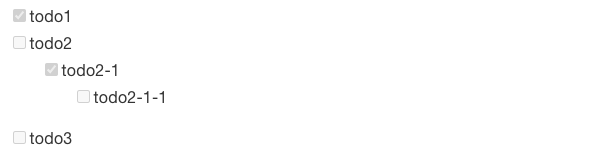

# honkit-plugin-todo

This is HonKit todo plugin.

_markdown_

```
- [x] todo1
- [ ] todo2
  - [x] todo2-1
    - [ ] todo2-1-1
- [ ] todo3
```

_honkit_



## usage

```
$ npm install -D honkit-plugin-todo
```

`book.json`

```json
{
  "plugins": ["todo"]
}
```
